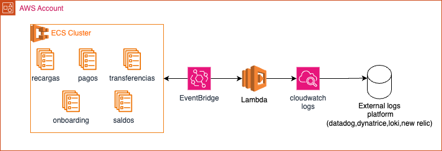

# RFC-001 — Monitoreo de capacidad máxima de microservicios en Amazon ECS

## 1. Contexto

Deuna! opera múltiples microservicios sobre Amazon ECS, cada uno con límites independientes de escalamiento. Los servicios utilizan políticas de Auto Scaling basadas en CPU y memoria, con un umbral del 60 %, y pueden escalar horizontalmente hasta alcanzar la capacidad máxima configurada.

La plataforma principal de observabilidad es externa a AWS y utiliza CloudWatch Logs como fuente de ingesta.

Para este escenario propongo una solución orientada a eventos que permita detectar cuándo un servicio ECS alcanza su capacidad máxima, generar una señal accionable y centralizar esta información en la plataforma de observabilidad existente.

## 2. Definición del problema

Cuando un servicio ECS alcanza el máximo de tareas configurado ya no puede continuar escalando horizontalmente. Si la carga continúa aumentando pueden aparecer problemas de latencia, errores o degradación del servicio.

El principal reto es que cada servicio puede tener un `MaxCapacity` diferente, por lo que no utilizaría un valor fijo para determinar cuándo un servicio está llegando a su límite.

La solución debe detectar esta condición para cualquier servicio ECS y enviar la señal a la plataforma de observabilidad actual, procurando generar el menor ruido posible.

## 3. Objetivos

- Detectar cuando un servicio ECS alcanza su `MaxCapacity`.
- Utilizar la integración existente con CloudWatch Logs.
- Generar una señal con suficiente contexto para facilitar el diagnóstico.
- Evitar eventos o alertas innecesarias.
- Centralizar los eventos de capacidad en la plataforma de observabilidad.
- Mantener una solución simple, de bajo costo y con poca carga operacional.

## 4. Solución propuesta

### 4.1 Mecanismo de detección

Propongo utilizar los eventos generados por **Application Auto Scaling** para detectar cuándo un servicio ECS alcanza su capacidad máxima.

Application Auto Scaling publica eventos `Application Auto Scaling Scaling Activity State Change` en Amazon EventBridge. Dentro del evento, la propiedad:

```text
scaledToMax = true
```

permite identificar una actividad de escalamiento que alcanzó el `MaxCapacity` configurado.

La arquitectura propuesta es:



### EventBridge

Crearía una regla de EventBridge que procese únicamente eventos correspondientes al escalamiento del `DesiredCount` de servicios ECS y que hayan alcanzado su capacidad máxima:

```json
{
  "source": [
    "aws.application-autoscaling"
  ],
  "detail-type": [
    "Application Auto Scaling Scaling Activity State Change"
  ],
  "detail": {
    "serviceNamespace": [
      "ecs"
    ],
    "scalableDimension": [
      "ecs:service:DesiredCount"
    ],
    "scaledToMax": [
      true
    ]
  }
}
```

Con este filtro:

- `serviceNamespace = ecs` limita los eventos a ECS.
- `scalableDimension = ecs:service:DesiredCount` limita la regla al escalamiento de tareas.
- `scaledToMax = true` identifica únicamente actividades que alcanzaron el límite configurado.

De esta forma evito ejecutar procesamiento adicional para actividades normales de Auto Scaling.

### Lambda

La regla de EventBridge invoca una función Lambda encargada de normalizar el evento antes de enviarlo al flujo de observabilidad.

El evento de Application Auto Scaling contiene información como:

- `resourceId`
- `oldDesiredCapacity`
- `newDesiredCapacity`
- `minCapacity`
- `maxCapacity`
- `scaledToMax`
- `direction`
- `statusCode`

Si necesito mayor contexto operacional, la Lambda puede consultar información adicional de ECS o métricas de CloudWatch, por ejemplo CPU y memoria del servicio al momento del evento.

La Lambda generaría un evento estructurado similar a:

```json
{
  "event_type": "ecs.capacity.max_reached",
  "cluster": "payments-cluster",
  "service": "payments-processor",
  "desired_tasks": 10,
  "max_tasks": 10,
  "capacity_percent": 100,
  "status": "MAX_CAPACITY_REACHED",
  "timestamp": "2026-08-01T07:47:00Z"
}
```

### CloudWatch Logs

La Lambda registra el evento estructurado en un Log Group dedicado.

A partir de ahí reutilizaría la integración existente entre CloudWatch Logs y la plataforma externa de observabilidad para generar alertas, búsquedas y dashboards.

Con este diseño, EventBridge se encarga del filtrado inicial y Lambda únicamente normaliza o enriquece los eventos que realmente requieren ser procesados.

### 4.2 Diseño de alertas

Cuando la plataforma de observabilidad recibe un evento `MAX_CAPACITY_REACHED`, generaría una alerta asociada al servicio afectado.

Por ejemplo:

```text
[ECS MAX CAPACITY] payments-processor

Environment: production
Cluster: payments-cluster
Service: payments-processor
Capacity: 10/10 tasks
CPU: 72%
Memory: 64%
Region: us-east-1

Status: MAX_CAPACITY_REACHED
```

Incluiría como mínimo:

- Ambiente y región.
- Cluster y servicio.
- Capacidad actual y `MaxCapacity`.
- CPU y memoria.
- Timestamp.
- Enlace al dashboard o runbook, si está disponible.

CPU y memoria se utilizarían como contexto para el diagnóstico e incluso para categorizar la alerta.

### 4.3 Reducción de ruido

Aplicaría la reducción de ruido desde el inicio del flujo.

EventBridge únicamente procesa eventos que cumplan:

```text
serviceNamespace   = ecs
scalableDimension  = ecs:service:DesiredCount
scaledToMax        = true
```

Esto evita ejecutar Lambda y generar señales para actividades normales de scale-out.

Sobre los eventos resultantes aplicaría:

- **Deduplicación:** una única alerta activa por `environment + cluster + service`.
- **Ventana de tiempo:** evitar notificaciones repetidas del mismo servicio durante un período definido.
- **Priorización por ambiente:** producción puede generar notificación al equipo de guardia mientras ambientes no productivos pueden mantenerse únicamente visibles en el dashboard.
- **Enriquecimiento:** capacidad, CPU y memoria se incluyen dentro del mismo evento en lugar de generar señales independientes.

El objetivo es que un evento `scaledToMax` genere una señal accionable y no múltiples alertas relacionadas con la misma condición.

### 4.4 Dashboard

Construiría el dashboard en la plataforma externa de observabilidad utilizando los eventos ingeridos desde CloudWatch Logs.

La vista principal estaría orientada a identificar rápidamente qué servicios alcanzaron su capacidad máxima:

| Servicio | Cluster | Capacidad | CPU | Memoria | Último evento |
| --- | --- | ---: | ---: | ---: | --- |
| payments-processor | payments-cluster | 10/10 | 82% | 76% | hace 2 min |
| transfers-api | transactions-cluster | 15/15 | 68% | 61% | hace 18 min |

Como indicadores principales mostraría:

- Servicios que alcanzaron `MaxCapacity`.
- Cantidad de eventos `MAX_CAPACITY_REACHED`.
- Servicios con mayor recurrencia.
- Eventos por ambiente o cluster.
- Alertas activas.

Para cada servicio permitiría consultar:

- Capacidad alcanzada y `MaxCapacity`.
- CPU y memoria registradas durante el evento.
- Fecha y hora.
- Historial y frecuencia de eventos.

Si la plataforma dispone de APM u otras métricas, correlacionaría esta información con latencia, errores y throughput para facilitar el diagnóstico.

### 4.5 Remediación automatizada

Como evolución de la solución, propondría asociar la alerta a un runbook que permita incrementar temporalmente el `MaxCapacity` cuando el diagnóstico confirme que el problema es falta de capacidad.

```text
MAX_CAPACITY_REACHED
        │
        ▼
Observability Platform
        │
        ▼
Runbook / Automation
        │
        ▼
Temporary MaxCapacity Update
```

No ejecutaría esta acción automáticamente únicamente por recibir `scaledToMax = true`. El aumento de capacidad debe realizarse cuando existan señales suficientes de que ECS es realmente el cuello de botella.

#### Reconciliación con Terraform

Si durante un incidente se modifica temporalmente `MaxCapacity` directamente en AWS, se genera drift respecto a la configuración declarada en Terraform.

Para evitar mantener ese drift, propondría que el runbook pueda iniciar un segundo flujo:

```text
Runbook
   │
   ├── Update MaxCapacity in AWS
   │
   └── Trigger IaC reconciliation
                │
                ▼
        Terraform Repository
                │
                ▼
            Pull Request
                │
                ▼
       Validate / Plan / Review
                │
                ▼
              Merge
```

El cambio permanente seguiría el flujo normal de IaC con validación, `terraform plan`, revisión y aprobación.

> **Nota:** considero el aumento de `MaxCapacity` una acción de mitigación y no una solución definitiva. Si un servicio alcanza frecuentemente su límite, revisaría dimensionamiento, performance, dependencias y configuración de Auto Scaling.