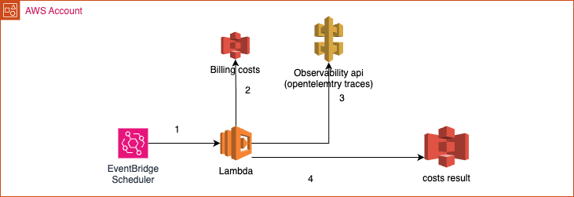
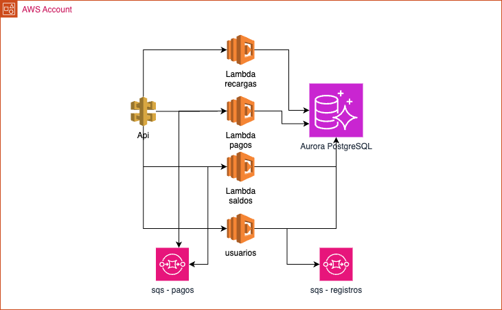

# RFC-002 — Costeo por tipo de transacción

## 1. Contexto

Deuna! procesa transacciones monetarias y no monetarias sobre una arquitectura de microservicios en AWS.

Cada flujo transaccional consume un conjunto diferente de servicios AWS como Lambda, API Gateway, RDS Aurora, SQS y S3. Cada servicio tiene su propio modelo de costeo y gran parte de la infraestructura es compartida entre los diferentes flujos.

Para este escenario propongo una solución que permita estimar cuánto cuesta procesar una transacción monetaria y una no monetaria, utilizando el consumo observado en los flujos y los costos reportados por AWS.

## 2. Definición del problema

AWS permite consultar el costo y consumo de los recursos mediante herramientas como AWS Cost Explorer, pero cuando la infraestructura es compartida este costo no puede asociarse directamente a una transacción monetaria o no monetaria.

Por ejemplo, Cost Explorer puede mostrar el costo por servicio durante un período y permitir filtros mediante tags como `team`, `service`, `component` o `environment`:

| Servicio AWS | Costo mensual |
| --- | ---: |
| Amazon Aurora | $8,000 |
| Amazon ECS | $3,500 |
| AWS Lambda | $1,200 |
| Amazon API Gateway | $800 |
| Amazon SQS | $300 |
| Amazon S3 | $200 |
| **Total** | **$14,000** |

Esta información permite conocer cuánto cuesta cada servicio, pero no cuánto cuesta procesar cada tipo de transacción.

Para realizar esta estimación necesitamos identificar si una transacción es `MONETARY` o `NON_MONETARY`, mantener esta información durante su recorrido y relacionar el consumo con los costos reportados por AWS.

Para el cálculo dividiría los costos en dos grupos:

- **Costos directos:** servicios cuyo consumo puedo relacionar con cada tipo de transacción.
- **Costos compartidos:** servicios utilizados por ambos tipos de transacción y cuyo costo necesito distribuir utilizando un driver definido.

El resultado será una estimación del costo promedio por tipo de transacción y no un cálculo exacto por request individual.

## 3. Objetivos

- Identificar las transacciones como `MONETARY` o `NON_MONETARY`.
- Mantener el tipo de transacción durante todo el flujo.
- Obtener los costos de los servicios utilizados en AWS.
- Diferenciar costos directos y compartidos.
- Definir un criterio simple para distribuir los costos compartidos.
- Calcular el costo aproximado por tipo de transacción.
- Automatizar la recolección y cálculo de la información.
- Presentar los resultados a producto y finanzas.

## 4. Solución propuesta

La solución combina dos fuentes de información:

1. **Observabilidad:** permite identificar el tipo de transacción y conocer la cantidad de transacciones generadas MONETARY / NON_MONETARY.
2. **AWS Billing:** permite obtener el costo real de los recursos utilizados durante el período.

Al combinar ambas fuentes puedo relacionar el costo de cada componente con el uso generado por cada tipo de transacción y aplicar un modelo que nos permita conocer el costo aproximado de cada transacción.


### 4.1 Identificación y propagación del tipo de transacción

Clasificaría cada transacción en el punto de entrada del flujo, donde se conoce la operación de negocio.

Por ejemplo:

```text
Recargas / Pagos / Transferencias / Retiros
                    │
                    ▼
                 MONETARY

Onboarding / Perfil / Consulta de saldo
                    │
                    ▼
               NON_MONETARY
```

Propongo instrumentar las aplicaciones con **OpenTelemetry** y agregar al contexto de la transacción:

```text
transaction.id   = "UUID" #identidicador unico para la transaccion e2e.
transaction.type = "MONETARY | NON_MONETARY"
```

Utilizaría además `service.name` para identificar qué microservicio está procesando la transacción.

Por ejemplo:

```text
transaction.type = "MONETARY"
service.name      = "payments"
```

En llamadas síncronas mantendría `transaction.type` durante la propagación del contexto entre microservicios.

Para flujos asíncronos, como SQS, incluiría esta información como metadata del mensaje para que el consumidor mantenga la clasificación original.


Un microservicio puede estar dedicado a un único tipo de flujo:

```text
payments      → MONETARY
balance       → NON_MONETARY
onboarding    → NON_MONETARY
```
En ese caso su consumo puede atribuirse directamente.

También pueden existir componentes compartidos que procesen ambos tipos. Para estos componentes utilizaría las métricas generadas por OpenTelemetry para conocer la distribución de consumo:

```text
transactions_total{
  transaction_type="MONETARY",
  service_name="transactions-worker"
}
```

La telemetría generada por los microservicios se enviaría a la plataforma de observabilidad existente.

Esto permitiría consultar cuántas operaciones de cada tipo fueron procesadas por cada microservicio:

| Microservicio | MONETARY | NON_MONETARY |
| --- | ---: | ---: |
| payments | 600 | 0 |
| balance | 0 | 400 |
| transactions-worker | 300 | 200 |

Estas métricas permiten identificar qué microservicios participan en cada flujo y qué proporción de su actividad corresponde a cada tipo de transacción.

### 4.2 Modelo de calculo de costos

Utilizaría las métricas anteriores para distribuir el costo de cada componente entre `MONETARY` y `NON_MONETARY`.

Consideraría dos tipos de costos.

#### Costos directamente atribuibles

Cuando el componente está dedicado a un tipo de transacción, atribuiría directamente su costo.

Por ejemplo:

```text
Lambda Payments
Costo AWS = $200

MONETARY     = $200
NON_MONETARY = $0
```

Cuando el componente es compartido pero puedo medir su consumo por `transaction.type`, utilizaría esa métrica como driver.

| Servicio | Driver |
| --- | --- |
| API Gateway | Requests |
| Lambda | Invocaciones |
| SQS | Mensajes |
| S3 | Requests/operaciones |

Por ejemplo:

```text
API Gateway
Costo AWS = $100

MONETARY     = 600 requests (60%) → $60
NON_MONETARY = 400 requests (40%) → $40
```

Cada componente se calcula de forma independiente, ya que puede tener una distribución diferente.

Por ejemplo, un worker podría procesar:

```text
ecs Worker
Costo AWS = $200

MONETARY     = 900 invocaciones (90%) → $180
NON_MONETARY = 100 invocaciones (10%) → $20
```

#### Costos compartidos

Para infraestructura donde no puedo relacionar directamente el consumo con `transaction.type`, utilizaría inicialmente la proporción global de transacciones de negocio como driver.

Aurora es un ejemplo:

```text
Business transactions

MONETARY     = 600 (60%)
NON_MONETARY = 400 (40%)

Aurora
Costo AWS    = $500

MONETARY     = 60% → $300
NON_MONETARY = 40% → $200
```

Este sería el modelo inicial porque mantiene el cálculo simple y trazable.

### 4.3 Obtención de costos desde AWS

Para obtener los costos utilizaría **AWS Billing and Cost Management**.

Usaría **AWS Cost Explorer** principalmente para consulta y validación manual de costos.

Para el proceso automatizado utilizaría **AWS Data Exports / Cost and Usage Report (CUR)** almacenado en S3 y consultado mediante Athena.

```text
AWS Billing
     │
     ▼
Data Exports / CUR
     │
     ▼
Amazon S3
     │
     ▼
Athena
     │
     ▼
Costo por componente
```

Mantendría una estrategia consistente de tagging para facilitar la relación entre los registros de billing y los componentes de la plataforma.

Por ejemplo:

```text
environment = production
service     = payments
component   = payments-worker
team        = transactions
```

De esta forma tendría las dos entradas necesarias para el cálculo:

```text
Observabilidad                     AWS Billing
      │                                │
      ▼                                ▼
Consumo por componente         Costo por servicio AWS
y transaction.type
      │                                │
      └──────────────┬─────────────────┘
                     ▼
              Modelo de costos
```

### 4.4 Pipeline automatizado de cálculo

Para automatizar el cálculo propongo un proceso batch mensual iniciado por **EventBridge Scheduler**.

Elegiría una ejecución mensual porque el objetivo no requiere calcular costos en tiempo real y permite trabajar con la información consolidada de billing del período.



Utilizaría una función Lambda como procesador del modelo.

El proceso sería:

1. Consultar mediante Athena los costos AWS del período agrupados por componente.
2. Consultar en la plataforma de observabilidad el consumo `MONETARY` y `NON_MONETARY` por componente.
3. Obtener la cantidad total de transacciones de negocio de cada tipo.
4. Aplicar el driver correspondiente a cada componente.
5. Calcular el costo `MONETARY` y `NON_MONETARY` de cada componente.
6. Sumar los costos atribuidos.
7. Dividir el costo total entre las transacciones de negocio de cada tipo.
8. Almacenar el resultado mensual en S3.

#### Ejemplo de cálculo




```text
MONETARY       = 600 transacciones
NON_MONETARY   = 400 transacciones
TOTAL          = 1,000 transacciones
```

Los microservicios están asociados a los siguientes flujos:

```text
Lambda recargas   → MONETARY
Lambda pagos      → MONETARY
Lambda saldos     → NON_MONETARY
Lambda usuarios   → NON_MONETARY
```

```text
SQS pagos         → MONETARY
SQS registros     → NON_MONETARY
```
Componentes como API Gateway y Aurora son compartidos entre ambos tipos de transacción.

Supongamos los siguientes costos mensuales obtenidos desde AWS Billing:

| Componente | Costo AWS |
| --- | ---: |
| S3 | $20 |
| CDN | $30 |
| API Gateway | $100 |
| Lambda recargas | $120 |
| Lambda pagos | $180 |
| Lambda saldos | $80 |
| Lambda usuarios | $100 |
| SQS pagos | $40 |
| SQS registros | $30 |
| Aurora PostgreSQL | $500 |
| **Total** | **$1,200** |

##### Componentes dedicados

Para los componentes dedicados a un único tipo de transacción, atribuiría directamente su costo.

```text
Lambda recargas
$120 → MONETARY

Lambda pagos
$180 → MONETARY

Lambda saldos
$80 → NON_MONETARY

Lambda usuarios
$100 → NON_MONETARY

SQS pagos
$40 → MONETARY

SQS registros
$30 → NON_MONETARY
```

##### API Gateway

API Gateway es compartido

Supongamos:

```text
API Gateway
Costo AWS = $100

MONETARY       = 600 requests (60%) → $60
NON_MONETARY   = 400 requests (40%) → $40
```

##### Aurora PostgreSQL

Aurora es utilizado por varios microservicios y su costo no puede relacionarse directamente con una transacción individual.

```text
Aurora
Costo AWS = $500

MONETARY       = 60% → $300
NON_MONETARY   = 40% → $200
```
##### Costo promedio por transacción

Después de atribuir y sumar los costos de todos los componentes, obtengo el costo total por tipo de transacción:

| Tipo | Transacciones | Costo atribuido |
| --- | ---: | ---: |
| MONETARY | 600 | $730 |
| NON_MONETARY | 400 | $470 |

Finalmente calculo el costo promedio dividiendo el costo total atribuido entre la cantidad de transacciones de negocio procesadas:

```text
MONETARY
$730 / 600 = $1.22 por transacción

NON_MONETARY
$470 / 400 = $1.18 por transacción
```
### 4.5 Presentación de resultados

Almacenaría los resultados mensuales en S3 y los dejaría disponibles para consulta mediante Athena.

Para los equipos de producto y finanzas presentaría la información mediante **Amazon QuickSight** o la plataforma de visualización existente.

La vista principal estaría enfocada en indicadores de negocio:

- Cantidad de transacciones procesadas por tipo.
- Costo total atribuido a `MONETARY` y `NON_MONETARY`.
- Costo promedio por transacción.
- Evolución mensual del costo por transacción.
- Distribución del costo por componente.

Utilizando el ejemplo anterior, el resumen del período sería:

| Indicador | MONETARY | NON_MONETARY |
| --- | ---: | ---: |
| Transacciones | 600 | 400 |
| Costo atribuido | $730 | $470 |
| Costo promedio | $1.22 | $1.18 |

También mantendría una vista con el detalle de atribución por componente:

| Componente | MONETARY | NON_MONETARY |
| --- | ---: | ---: |
| S3 | $12 | $8 |
| CDN | $18 | $12 |
| API Gateway | $60 | $40 |
| Lambda recargas | $120 | $0 |
| Lambda pagos | $180 | $0 |
| Lambda saldos | $0 | $80 |
| Lambda usuarios | $0 | $100 |
| SQS pagos | $40 | $0 |
| SQS registros | $0 | $30 |
| Aurora PostgreSQL | $300 | $200 |
| **Total** | **$730** | **$470** |

Para **producto y finanzas**, priorizaría el costo promedio por tipo de transacción y su evolución mensual.

Para **ingeniería**, mantendría el detalle por componente para identificar qué recursos tienen mayor impacto sobre el costo y dónde existen oportunidades de optimización.

De esta forma, el mismo modelo permite tener una vista agregada orientada al negocio y una vista técnica para análisis y optimización de costos.
